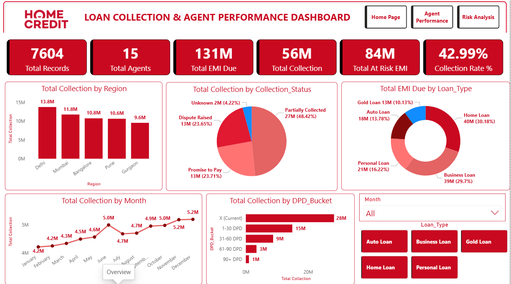
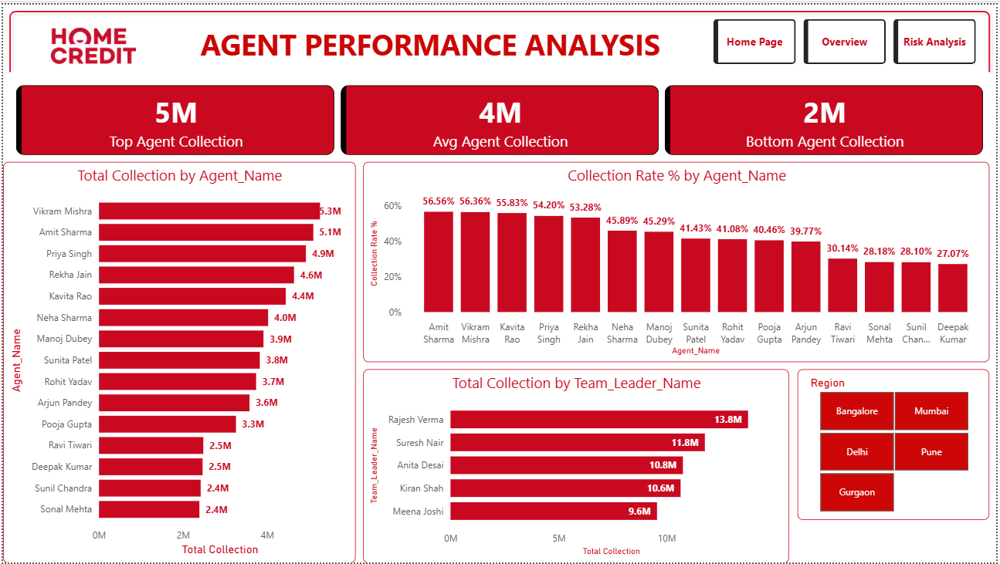
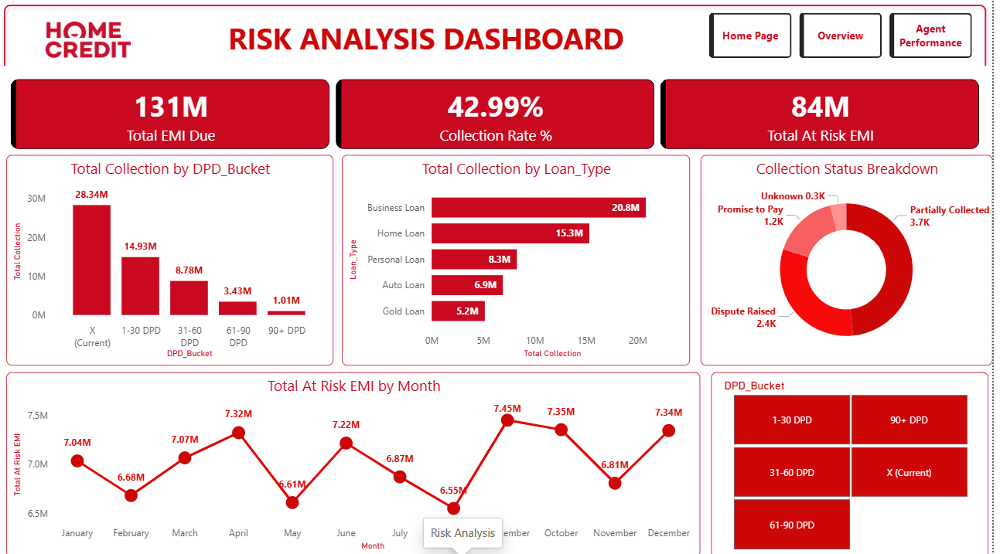

# 🏦 Loan Collection & Agent Performance Analysis

> **End-to-end Data Analytics Project | BFSI Domain**
> 
> Analyst: **Rajeev Kumar** | Tools: Python · SQL · Excel · Power BI

---

## 📌 Project Overview

This project analyzes **loan collection and agent performance data** for a BFSI (Banking, Financial Services & Insurance) company. The goal was to find patterns, identify problems, and give actionable business recommendations using data.

| Detail | Information |
|--------|-------------|
| **Domain** | BFSI — Loan Collections |
| **Dataset** | 7,604 records · 17 columns · Jan–Dec 2024 |
| **Agents** | 15 agents across 5 regions |
| **Regions** | Delhi · Mumbai · Bangalore · Pune · Gurgaon |
| **Loan Types** | Personal · Home · Auto · Business · Gold Loan |

---

## 🛠️ Tools & Technologies

| Tool | Purpose |
|------|---------|
| **Python** (Pandas, Matplotlib, Seaborn) | Data Cleaning & EDA |
| **MySQL** | SQL Analysis — 14 Business Queries |
| **Microsoft Excel** | MIS Dashboard — Pivot Tables & Charts |
| **Power BI** | Interactive 3-Page Dashboard |

---

## 📁 Project Structure

```
Loan_Collection_Analysis/
│
├── 📂 Dataset/
│   ├── Loan_Collection_Raw_Data.xlsx       # Original raw dataset
│   └── Loan_Collection_Cleaned_Data.xlsx   # Cleaned dataset
│
├── 📂 PYTHON_Data_Cleaning_And_EDA/
│   ├── Loan_Collection_EDA.ipynb           # Jupyter Notebook
│   ├── chart1_collection_status.png        # EDA Charts
│   ├── chart2_region_collection.png
│   ├── chart3_monthly_trend.png
│   ├── chart4_agent_performance.png
│   ├── chart5_dpd_analysis.png
│   ├── chart6_loan_type_collection.png
│   ├── chart7_target_achievement.png
│   └── chart8_contact_vs_collection.png
│
├── 📂 SQL_Loan_Collection_Analysis/
│   └── loan_collection_Analysis.sql        # 14 SQL Queries
│
├── 📂 EXCEL DASHBOARD/
│   └── Loan_Collection_Dashboard.xlsx      # Excel MIS Dashboard
│
├── 📂 Power BI/
│   └── Loan_Collection_Analysis_PBI.pbix   # Power BI Dashboard
│
└── 📂 Screenshots/
    ├── dashboard_page1.png                 # Overview Dashboard
    ├── dashboard_page2.png                 # Agent Performance
    └── dashboard_page3.png                 # Risk Analysis
```

---

## 🔍 Phase 1 — Data Cleaning (Python)

### Problems Found & Fixed

| # | Problem | Column | Fix Applied |
|---|---------|--------|-------------|
| 1 | 172 duplicate rows | Full Dataset | `drop_duplicates()` |
| 2 | 403 missing values | EMI_Collected_Amount | `fillna(0)` |
| 3 | 306 missing values | Total_Calls_Made | `fillna(mean)` |
| 4 | 300 missing values | Collection_Status | `fillna('Unknown')` |
| 5 | Outlier — 10x higher value | EMI_Due_Amount | IQR Method |
| 6 | Inconsistent format | Loan_Type, Agent_Name | `str.title()` |
| 7 | Wrong data type | Calls, Contacts | `astype(int)` |
| 8 | Wrong month ordering | Month | `pd.Categorical` |

**Result:** 7,776 rows → 7,604 clean records ✅

---

## 📊 Phase 2 — EDA (Python)

### 8 Business Questions Answered

| Chart | Business Question | Key Finding |
|-------|------------------|-------------|
| Collection Status | How many customers paid? | 48% Partially Collected |
| Region Wise | Which region performs best? | Delhi — 50.59% rate |
| Monthly Trend | What is the collection trend? | 23% growth Jan→Dec |
| Agent Performance | Who are top/bottom agents? | 54% gap between top & bottom |
| DPD Analysis | How much EMI is at risk? | 8.4 Crore (64%) at risk |
| Loan Type | Which loan has best rate? | Business Loan — 53.34% |
| Target Achievement | Are agents hitting targets? | Only 4/15 above benchmark |
| Contact Rate | Does contact rate drive collection? | Strong positive correlation ✅ |

---

## 💾 Phase 3 — SQL Analysis (MySQL)

### 14 Queries across 3 Levels

**Basic Level (Q1–Q6)**
- Total Collection by Region
- Top 5 Agents by Collection
- Monthly Collection Trend
- DPD Bucket Wise Analysis
- Loan Type Collection Rate
- Collection Status Breakdown

**Intermediate Level (Q7–Q9)**
- Team Leader Wise Performance
- Month Over Month Growth (`LAG()`)
- Contact Rate by Agent

**Advanced Level (Q10–Q14)**
- Agent Ranking Within Region (`RANK() OVER PARTITION BY`)
- Running Total of Collection (`SUM() OVER ORDER BY`)
- Agent vs Team Average (`AVG() OVER PARTITION BY`)
- Top Agent Per Region Using CTE (`WITH CTE + ROW_NUMBER()`)
- Performance Tier Classification (`CASE WHEN + Subquery`)

---

## 📈 Phase 4 — Excel MIS Dashboard

### 6 Pivot Tables + 4 Charts

| Pivot Table | Analysis |
|-------------|----------|
| Pivot 1 | Region Wise Collection |
| Pivot 2 | Monthly Collection Trend |
| Pivot 3 | Agent Wise Performance |
| Pivot 4 | DPD Bucket Analysis |
| Pivot 5 | Loan Type Analysis |
| Pivot 6 | Collection Status Breakdown |

**Dashboard Features:**
- 5 KPI Cards — Total Collection, Rate%, Agents, Records, EMI Due
- 4 Interactive Charts — Bar, Line, Pie, Column
- Month Filter — Dropdown slicer

---

## 🖥️ Phase 5 — Power BI Dashboard

### 3-Page Interactive Dashboard

**Page 1 — Overview**



**Page 2 — Agent Performance**



**Page 3 — Risk Analysis**



### DAX Measures Used
```
Total Collection      = SUM(EMI_Collected_Amount)
Collection Rate %     = DIVIDE(Collected, Due, 0) * 100
Total At Risk EMI     = CALCULATE(SUM(Due), DPD <> "X (Current)")
Top Agent Collection  = MAXX(SUMMARIZE(...), Agent_Total)
Bottom Agent          = MINX(SUMMARIZE(...), Agent_Total)
```

---

## 💡 Key Business Insights

1. **Collection Rate is only 42.99%** — 57% EMI still uncollected — urgent strategy needed
2. **Delhi is top region** — 1.37 Crore — Gurgaon lowest — 0.95 Crore — 42L gap
3. **Contact Rate drives collection** — High contact agents collect 2x more than low contact agents
4. **8.4 Crore (64%) EMI is at risk** — immediate recovery plan needed
5. **Business Loan best rate** — 53.34% — Auto Loan lowest — 38.22%
6. **June campaign spike** — +9.36% MOM growth — should be replicated every quarter

---

## 🎯 Recommendations

| # | Recommendation | Expected Impact |
|---|----------------|----------------|
| 1 | Improve contact rate of bottom agents | Can double their collection |
| 2 | Investigate 32% dispute raised cases | Reduce dispute volume |
| 3 | Replicate June campaign every quarter | +9% quarterly growth |
| 4 | Immediate follow up on 1-30 DPD — 3.24 Crore | Prevent escalation to higher DPD |
| 5 | Product specific strategy for Auto Loan | Improve from 38.22% rate |
| 6 | Replicate Delhi strategy in Gurgaon | Close 42L regional gap |

---

## 📬 Contact

**Rajeev Kumar**
- 📧 Email: hireraajeev@gmail.com
- 💼 LinkedIn: [linkedin.com/in/reactwithrajeev](https://www.linkedin.com/in/reactwithrajeev/)
- 🐙 GitHub: [github.com/reactwithrajeev](https://github.com/reactwithrajeev)

---

> ⭐ If you found this project helpful, please give it a star!
